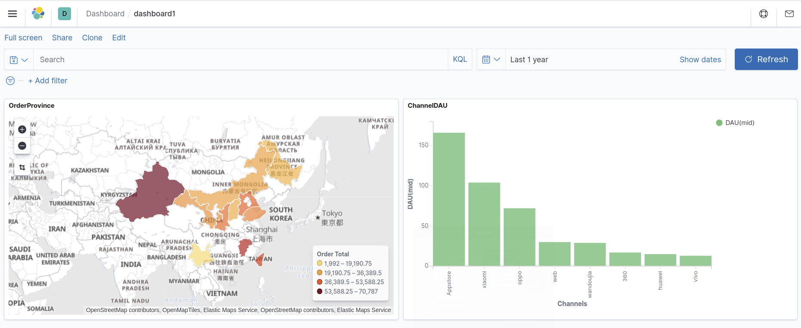
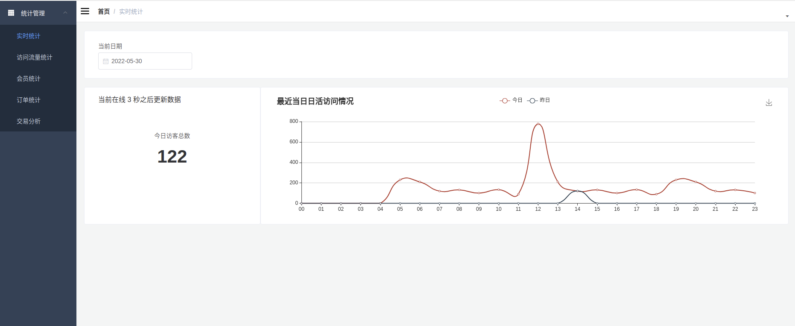
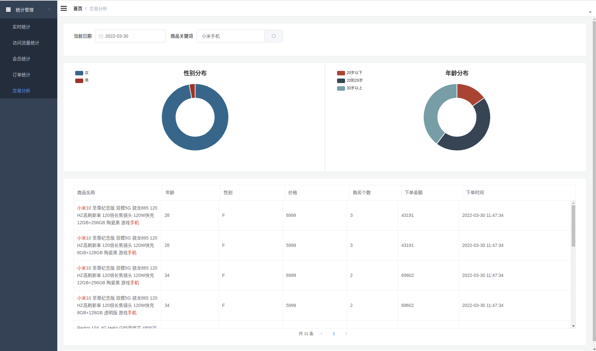

# Real-time e-commerce data warehouse using Spark-Streaming

# Description
In the project, Spark-Streaming is used to process two types of data generated by a typical e-commerce site: the log data and the transaction data.

Realtime log data are written directly into Kafka. Realtime transaction (order) data are collected from MySQL using Maxwell first and then written into Kafka. 
At this stage, Kafka can be considered as the ODS layer.

I split the log data flow into 5 topics based on the data types and write them back into Kafka. I write the fact tables from MySQL into 2 Kafka topics and write the dimension tables into Redis.
At this stage, Redis can be considered as the DIM layer and the processed data in Kafka can be considered as the DWD layer.

After processing and joining operations, I write the wide tables into ElasticSearch (OLAP) and use Kibana as a simple BI tool for visualization and creating dashboards.

To interact with a front-end that supports ad-hoc queries and visualization, I write a data interface using SpringBoot.

# Built with
- Spark-Streaming
- Kafka
- Redis
- MySQL
- Maxwell
- ElasticSearch
- Kibana
- SpringBoot

# Notes
- "Exact-Once" consumption of Kafka topics: implemented through "At-least Once" consumption (may have duplicates), together with idempotent writes into ES. I chose to maintain consumer offsets in Redis (OffsetsUtils.scala).
- Reduce the number of connections (and other resources) by using "foreachPartition" and pay special attention on where the codes are executed (i.e., on driver or on executor).
- Use "fullOuterJoin" to prevent data loss when joining two streams. When two streams are out-of-sync, store one of them in Redis temporarily and wait for the other stream (DwdOrderApp.scala)